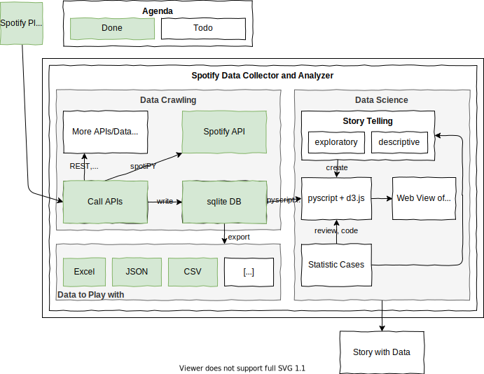

# Spotify Playlist Analyizer

This overview shows how the components work together:



## Prerequisits

Install Python and install/upgrade the following libs using PIP:

``` py
pip install pandas openpyxl spotipy --upgrade
```

## Environemnt Variables

Windows

``` bat
$Env:SPOTIPY_CLIENT_ID = "XXXX"
$Env:SPOTIPY_CLIENT_SECRET = "XXXX"
```

Linux

``` bash
export SPOTIPY_CLIENT_ID='XXXX'
export SPOTIPY_CLIENT_SECRET='XXXX'
```

## Testing

### Spotify

If you want to debug the code, here are some Spotify example IDs you can use:

- playlistID = 'spotify:playlist:32O0SSXDNWDrMievPkV0Im'
- artistID = '0gxyHStUsqpMadRV0Di1Qt'
- albumID = '5Z9iiGl2FcIfa3BMiv6OIw'
- trackID = "4cOdK2wGLETKBW3PvgPWqT"

For details on the spotify api [read these docs](https://developer.spotify.com/console/).
